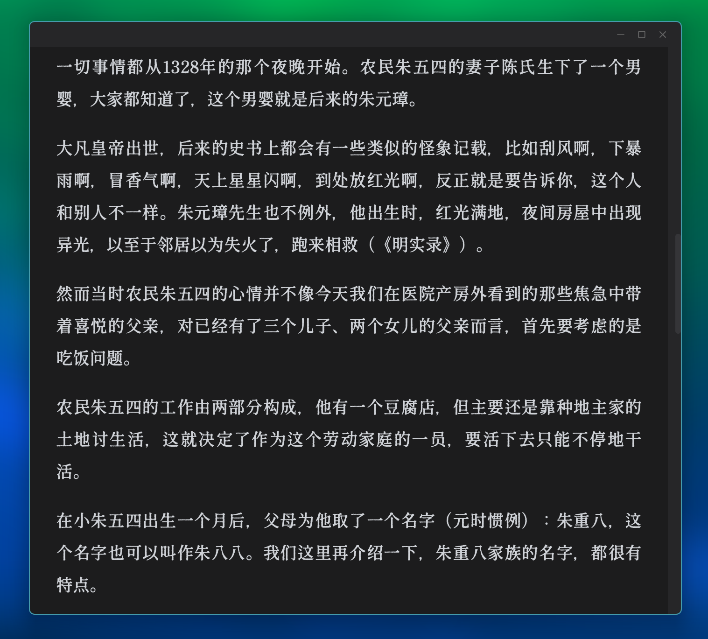

# 微信读书桌面版

极简微信读书桌面客户端。基于 [Pake](https://github.com/tw93/Pake)（Tauri + WebView2）将[微信读书网页版](https://weread.qq.com/)打包为 Windows 桌面应用。

## 预览



## 特性

- 无边框窗口，沉浸式阅读
- 标题栏和滚动条颜色自动跟随页面背景
- 向下滚动时隐藏顶部书名栏和右侧按钮
- 自适应暗色模式
- 窗口大小记忆
- 单实例运行

## 下载

从 [Releases](https://github.com/kangkang042/weread-desktop/releases) 下载 `WeChatRead.exe`，双击运行。需要 Windows 10+。

## 构建

```bash
npm run build
```


## 致谢

借助 [Claude Code](https://github.com/anthropics/claude-code) 和 [DeepSeek API](https://platform.deepseek.com/) 开发。
